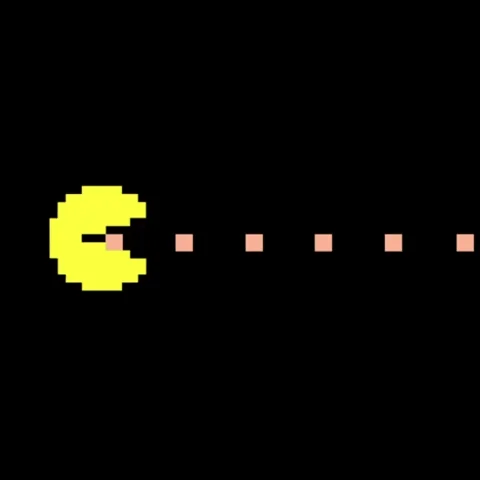
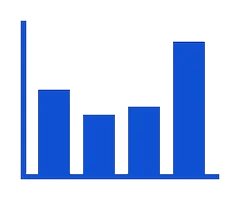

      
  <h1 align="center" style="display: flex; align-items: center; justify-content: center; gap: 10px;">
    Hello! I'm Hsu Myat Wai Maung🌸
  </h1>
  <h3 align="center"><b>✨ Crafting beautiful, functional webs as a passionate developer ✨</b></h3>

  
          
  

##  About Me

> I'm a final year Computer Science student with a passion for building **elegant, user-friendly, and efficient** webs. I love turning complex problems into simple, beautiful, and intuitive designs.

<table>
<tr><td>🔭</td><td><b>Currently working on</b></td><td>a cool project</td></tr>
<tr><td>👯</td><td><b>Looking to collaborate on</b></td><td>open-source projects</td></tr>
<tr><td>💬</td><td><b>Ask me about</b></td><td>React,JavaScript,TypeScript</td></tr>
<tr><td>📫</td><td><b>How to reach me</b></td><td>kienbrown76@gmail.com</td></tr>
<tr><td>👥</td><td><b>Pronouns</b></td><td>she/her</td></tr>
</table>

##  My Tech Stack

Here are some of the technologies I'm proficient in:

<strong>Languages:</strong>   
&nbsp;&nbsp;&nbsp;&nbsp;
&nbsp;&nbsp;&nbsp;&nbsp;
&nbsp;&nbsp;&nbsp;&nbsp;
&nbsp;&nbsp;&nbsp;&nbsp;

<strong>Frontend:</strong>   
&nbsp;&nbsp;&nbsp;&nbsp;
&nbsp;&nbsp;&nbsp;&nbsp;
&nbsp;&nbsp;&nbsp;&nbsp;
&nbsp;&nbsp;&nbsp;&nbsp;

<strong>Backend & Others:</strong>   
&nbsp;&nbsp;&nbsp;&nbsp;
&nbsp;&nbsp;&nbsp;&nbsp;
&nbsp;&nbsp;&nbsp;&nbsp;

##  My GitHub Stats

  

  
      

  

